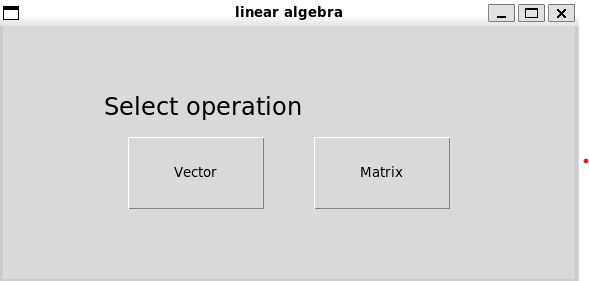
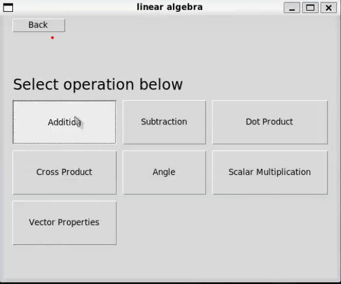
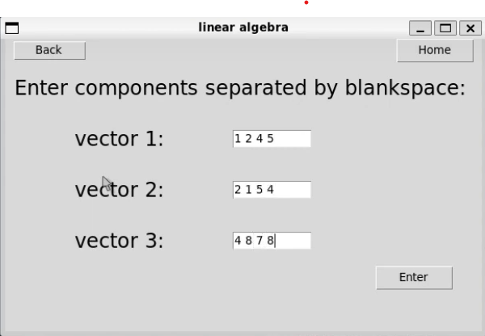
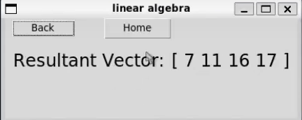
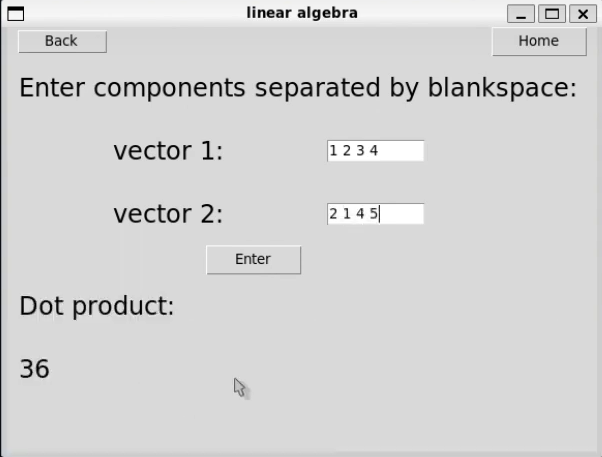
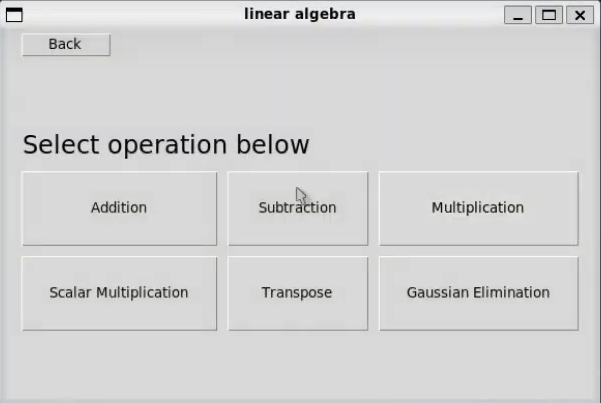
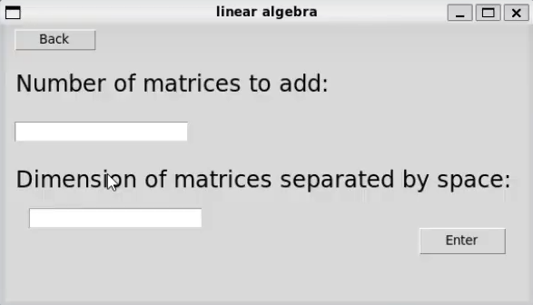
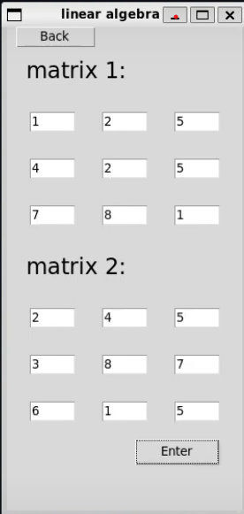
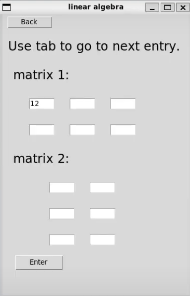
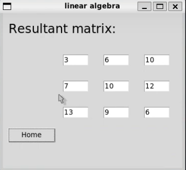

# Matrix Calculator

Here are some screenshots of the application run on Linux Ubuntu:
  
  
  
  
  
  
  

  
  
   

  
  
   
   
This is my CS50P final project, Linear Algebra Calculator. This is simple GUI application, implmented in python using tkinter library that can proform basic vector and matrix operations. 

I have used tkinter library to implement GUI.

This is GUI calculator written in python using tkinter library that performs several operations encountered in branch of mathematics known as Linear Algebra. 
Linear Algebra is based on objects known as vectors and matrices. Both vectors and matrices are related and have several properties and operations defined which are largely used in computations. 
  
  Vectors are abstract objects consisting of array of numbers with operations of addition and scalar multiplication, scalar product, cross  product defined on them. Vectors has properties like dimensions, length of a vector, components and angle they make with each other and also with coordinate axes. 

  Matrix is also an abstract object consisting of rectangular array of numbers. Matrix has dimensions m x n, where m is number of rows and n is number of columns. Several operations are defined on them including addition, Multiplication, Scalar Multiplication, Determinant, etc.

  Matrix can be thought of as list of row vectors. This notion can simplify code by using vector objects and their operations in implementing a matrix object and its operations. 

  >**Application is designed to highlight this connection between matrices and vectors.**

  Both Vector and Matrix are defined as classes where Matrix is a list of its row vectors and all row operations are performed using Vector methods.

  >**Because the order of operations is not intended to be too complex and to emphasize the relationship between vectors and matrices, the code is not written with maximum efficiency. In some operations, the code could have been written without using either of the objects, but both class objects are still employed to perform their respective operations.**

  I have used tkinter library because it comes with python and was easy to learn. It renders widgets in old looks but works well. (appearence was not a priority).

  Operations in GUI are written as a seqence of functions. One function displays one window, takes user input and passes to next function in sequence which updates the window if needed, finally terminating with show_result method which displays the resultant Matrix. In case of vectors such method is not used in every operation.

  Application consist of following files:
  - vector.py,  project.py, test_project.py, requirements.txt

  vector.py is a helper module while project.py is a main file. test_project.py is test file. requrements.txt has required modules which is only tkinter.

  vector.py file contains definition of Vector and Matrix classes. Both classes contains special methods like __str__, __add__, etc that defines addition +, subtraction -, multiplication * and division /, between respective objects. Such definitions follows directly from theory of Linear Algebra. 

  Vectors have extra methods such as dot product, cross product, normalise, get_angle (between two vectors), get_theta, get_phi. All follows from theory of linear algebra. Special method str gives readable output of vector to print.

  Matrix consists of list of row vectors called rows and dimensions m x n. Special methods are defined like __str__, add, subtract, mul etc that defines addition, subtraction, multiplcation (both scalar and betwee matrices). Other methods include transpose to transpose given matrix, triangularise() that lower triangularises given matrix, pivoting() which updates matrix with highest pivot and back() for back substitution used in Gaussian Elimination. get_matrix() is a method that creates matrix using input from user in terminal not in GUI. 

  project.py consists of main function. Three classes are defined in this file. 
  
  **MyApp** which creates basic starting Home window of the application using tkinter module. Several helpful methods that are used in entire program are also defined. *back* and *home* buttons runs previous functions in sequence.

  **VectorOps** class constructs window of vector operations. operations is a dictionary that stores name and function of operation and is used in creating buttons for ope.rations. 

  **MatrixOps** class constructs matrix operations window. All matrix related operations and helper functions are defined here.

  I apologise for not writing explicit documentation for the project given my time constraints with other academic works. If any doubt please contact me through linked in. 
  If you have any suggestions or coomnts, please kindly provide it to me.
  Thanks

  

   

     
    

  
  
  

